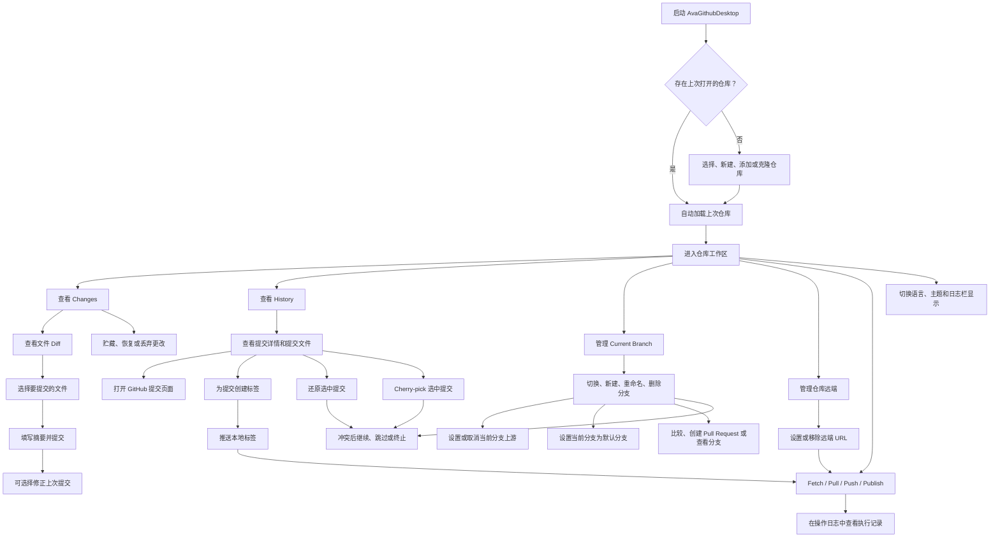

# AvaGithubDesktop 需求文档

## 项目定位

AvaGithubDesktop 是一个参考 GitHub Desktop 交互和常用工作流的跨平台 Git 桌面客户端，使用 Avalonia 开发，面向 Windows、Linux 和 macOS。

## 开发约定

- 使用 Avalonia、Prism 8.x、ReactiveUI.Avalonia 组织 MVVM 应用结构。
- 使用 Semi.Avalonia、Ursa.Avalonia 和项目自定义主题资源维护界面样式。
- 使用 Lang.Avalonia.Json 和 T4 维护中英文资源。
- 使用 CodeWF.EventBus 做进程内消息通信。
- 使用 CodeWF.Markdown 展示关于、更新日志等 Markdown 内容。
- 使用 CodeWF.LogViewer 展示操作日志，并将语言、主题、日志栏显隐等设置持久化。

## 已完成功能

- 仓库打开、添加已有仓库、新建仓库、Clone 仓库、最近仓库记录和启动恢复上次仓库。
- 仓库远端查看、设置和移除。
- Changes 文件列表、文件过滤、选择文件提交。
- Amend last commit，可修正上次提交内容或提交信息。
- 文本 Diff、图片 Diff、二进制文件提示和未跟踪文本文件预览。
- History 提交列表、提交文件列表、复制 SHA、打开提交 GitHub 页面。
- History 选中提交创建 lightweight tag 或 annotated tag。
- History 选中提交 Revert，还原提交并刷新工作区。
- History 选中提交 Cherry-pick，将提交应用到当前分支。
- Revert 和 Cherry-pick 冲突后的继续和终止控制。
- Changes 区域显示 merge、rebase、revert、cherry-pick 冲突操作提示。
- Changes 冲突文件使用统一 Conflict 状态和冲突色徽标。
- Repository 菜单 Push tags，推送本地标签到当前远端。
- 本地分支列表、切换分支、新建分支、重命名分支、删除本地分支。
- 当前分支设置或取消上游分支跟踪。
- 当前分支可设为当前远端的默认分支引用。
- Merge/Rebase 冲突后的继续、跳过和终止控制。
- Fetch、Pull、Push、未发布分支 Publish branch 同步入口。
- Stash all changes、Restore stash、Discard stash。
- Repository 菜单和仓库列表右键菜单常用入口。
- Changes 和 History 文件项右键菜单常用入口。
- GitHub OAuth 登录、账户状态展示和退出登录。
- GitHub 仓库、分支、比较、Pull Request、Issue 相关浏览器入口。
- 中英文切换、Semi 多主题切换、操作日志栏显隐持久化。
- 简洁应用图标、关于窗口和更新日志窗口。

## 使用流程

## 进行中功能

- 持续对齐 GitHub Desktop 常用操作的菜单顺序、文案和交互细节。
- 优化主窗口和主 ViewModel 的职责拆分，减少单文件体积。
- 完善截图验证记录，保持每个可见功能都有基本界面验证。

## 计划功能

- 内置或托管 Git 运行时，减少对系统 Git 安装的依赖。
- 更完整的默认分支管理。
- 冲突文件逐项辅助解决。
- 更多常用 Git 操作。
- GitHub Pull Request、Issue、通知等更完整的账号集成。
- 子模块、Git LFS 和大文件场景支持。
- 设置中心、快捷键和更完整的偏好配置。
