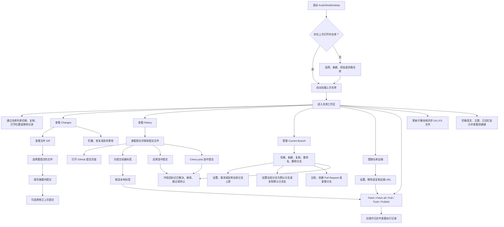

# AvaGithubDesktop 需求文档

## 项目定位

AvaGithubDesktop 是一个参考 GitHub Desktop 交互和常用工作流的跨平台 Git 桌面客户端，使用 Avalonia 开发，面向 Windows、Linux 和 macOS。

## 开发约定

- 使用 Avalonia、Prism 8.x、ReactiveUI.Avalonia 组织 MVVM 应用结构。
- 使用 Semi.Avalonia、Ursa.Avalonia 和项目自定义主题资源维护界面样式。
- 使用 Lang.Avalonia.Json 和 T4 维护中英文资源。
- 使用 CodeWF.EventBus 做进程内消息通信。
- 使用 CodeWF.Markdown 展示关于、更新日志等 Markdown 内容。
- 使用 CodeWF.LogViewer 展示操作日志，并将语言、主题、日志栏显隐等设置持久化。

## 已完成功能

- 仓库打开、添加已有仓库、新建仓库、Clone 仓库、最近仓库记录、从列表移除仓库和启动恢复上次仓库。
- 仓库工作区加载由独立服务集中读取仓库快照、分支列表和历史提交。
- 仓库选择器列表过滤、Recent 分组、排序和当前仓库高亮由列表构建器集中维护。
- 仓库远端查看、设置、移除和复制远端 URL。
- Changes 文件列表、文件过滤、选择文件提交。
- Changes 文件过滤、冲突过滤、选中项恢复和全选状态由列表状态构建器集中维护。
- Amend last commit，可修正上次提交内容或提交信息。
- Commit 和 Amend last commit 的忙碌状态、状态消息、成功后表单清空和工作区刷新模板复用仓库操作命令服务。
- 文本 Diff、图片 Diff、二进制文件提示和未跟踪文本文件预览。
- History 提交列表、提交文件列表、复制 SHA、打开提交 GitHub 页面。
- History 选中提交文件列表构建和选中项恢复由状态构建器集中维护。
- History 选中提交创建 lightweight tag 或 annotated tag。
- History 创建标签的忙碌状态、状态消息和失败提示模板复用仓库操作命令服务。
- History 选中提交 Revert，还原提交并刷新工作区。
- History 选中提交 Cherry-pick，将提交应用到当前分支。
- History 选中提交 Revert 和 Cherry-pick 的忙碌状态、状态消息和刷新模板复用仓库操作命令服务。
- Revert 和 Cherry-pick 冲突后的继续和终止控制。
- Changes 区域显示 merge、rebase、revert、cherry-pick 冲突操作提示。
- Changes 冲突文件使用统一 Conflict 状态和冲突色徽标。
- Changes 可一键过滤只查看冲突文件。
- Changes 冲突文件可逐项或批量标记为已解决，辅助继续 merge、rebase、revert 和 cherry-pick。
- Changes 标记冲突已解决和丢弃更改的忙碌状态、状态消息和成功后刷新模板复用仓库操作命令服务。
- Repository 菜单 Push tags，推送本地标签到当前远端。
- Push tags 和 Update submodules 的忙碌状态、状态消息和成功后刷新模板复用仓库操作命令服务。
- 本地分支列表、切换分支、新建分支、复制当前分支名、重命名分支、删除本地分支。
- 新建分支和切换分支的忙碌状态、状态消息和成功后刷新模板复用仓库操作命令服务。
- 分支重命名、设置/取消上游、删除分支和设置默认分支的命令运行模板复用仓库操作命令服务。
- Current Branch 列表过滤、当前分支优先选中和旧选中项恢复由分支状态构建器集中维护。
- 当前分支设置、取消或复制上游分支跟踪。
- 当前分支可设为当前远端的默认分支引用，并可复制默认分支名。
- Merge/Rebase 冲突后的继续、跳过和终止控制。
- Update from default、Merge、Squash merge 和 Rebase 的动态完成消息、冲突后刷新和命令运行模板复用仓库操作命令服务。
- merge、rebase、revert、cherry-pick 冲突恢复命令统一由仓库操作状态命令服务执行。
- Fetch、Fetch all remotes、Pull、Push、未发布分支 Publish branch 同步入口。
- Fetch、Fetch all、Pull、Push、Publish 和 Git LFS 远端同步主流程复用仓库操作命令服务，具体 Git 命令分派独立维护。
- Git 分支、远端分支、ahead/behind、最近提交、变更文件和历史提交文件解析由独立输出解析器集中维护。
- Repository 菜单 Fetch LFS objects 和 Pull LFS files，支持手动同步 Git LFS 对象和工作区文件。
- 同步按钮标题、说明、徽标和远端操作提示由同步状态服务集中维护。
- Repository 菜单 Update submodules，初始化并递归更新子模块。
- Stash all changes、Restore stash、Discard stash。
- Stash all changes 的忙碌状态、动态完成提示和成功后刷新模板复用仓库操作命令服务。
- Restore stash 和 Discard stash 的忙碌状态、状态消息和成功后刷新模板复用仓库操作命令服务。
- Repository 菜单和仓库列表右键菜单常用入口，可复制当前仓库名称和路径。
- Changes 和 History 文件项右键菜单常用入口。
- GitHub OAuth 登录、账户状态展示和退出登录。
- GitHub 仓库、分支、比较、Pull Request、Issue 相关浏览器入口。
- 仓库外部交互服务集中维护剪贴板、文件管理器、外部编辑器和 GitHub 浏览器入口。
- 中英文切换、科技蓝主调的 Light/Dark/Aquatic/Desert/Dusk/NightSky 多主题切换、操作日志栏显隐持久化。
- 应用自定义主题资源覆盖工具栏、面板、Diff、操作日志、状态栏、弹窗标题栏和提示条，主题变体集中在主题包维护。
- 工具栏分段按钮使用连续渐变背景、清晰分隔线和悬停反馈，避免主题色在仓库、分支、同步区域重复断裂。
- Changes/History tab 选中态由主题样式类控制，不在主窗口 ViewModel 中维护硬编码颜色。
- 常用菜单快捷键、`Ctrl+Enter` 快速提交、仓库/分支/Changes 过滤快捷聚焦和 Help 快捷键说明窗口。
- `Ctrl+1` 和 `Ctrl+2` 可直接切换 Changes 与 History 页面。
- 简洁应用图标、关于窗口和更新日志窗口。

## 使用流程

## 进行中功能

- 持续对齐 GitHub Desktop 常用操作的菜单顺序、文案和交互细节。
- 优化主窗口和主 ViewModel 的职责拆分，减少单文件体积。
- 完善截图验证记录，保持每个可见功能都有基本界面验证。

## 计划功能

- 内置或托管 Git 运行时，减少对系统 Git 安装的依赖。
- 更完整的默认分支管理。
- 更完整的冲突文件逐项辅助解决。
- 更多常用 Git 操作。
- GitHub Pull Request、Issue、通知等更完整的账号集成。
- 更完整的 Git LFS 和大文件场景支持。
- 设置中心、可配置快捷键和更完整的偏好配置。
